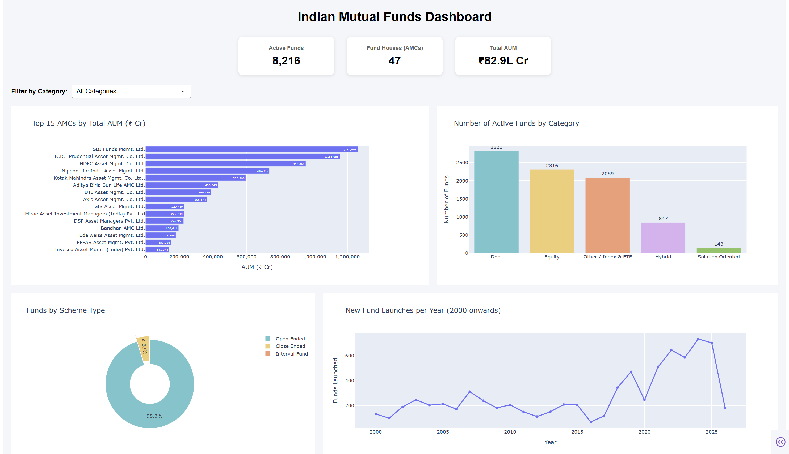

# 🇮🇳 Indian Mutual Funds Dashboard

An interactive dashboard built with Python and Dash that visualizes the Indian mutual fund industry using data from 8,216 active funds across 47 AMCs.

---

## 📸 Preview



---

## 📊 What the Dashboard Shows

- **KPI Cards** — Total active funds, number of AMCs, and combined AUM at a glance
- **Top 15 AMCs by AUM** — Horizontal bar chart showing which fund houses manage the most money
- **Funds by Category** — Distribution of active funds across Equity, Debt, Hybrid, Index/ETF, and Solution Oriented categories
- **Scheme Type Split** — Donut chart showing Open Ended vs Close Ended vs Interval Fund breakdown
- **Fund Launches Over Time** — Line chart showing new fund launches per year from 2000 onwards
- **Category Filter** — Interactive dropdown that filters all 4 charts simultaneously

---

## 🔍 Key Findings

| # | Finding | Value |
|---|---------|-------|
| 🏆 | **Largest AMC** | SBI Funds Management Ltd. |
| 📂 | **Most Funds In** | Debt — 2,821 active funds |
| 💰 | **Average Fund Size** | ₹1,009 Cr |
| 📈 | **Peak Launch Year** | 2024 — 706 funds launched |
| 🔓 | **Open Ended Share** | 95.3% of all active funds |

> *Based on 8,216 active funds across 47 AMCs with a combined AUM of ₹82.9L Cr (Jan–Mar 2026)*

---

## 🛠️ Tech Stack

| Tool | Purpose |
|------|---------|
| Python | Core language |
| Pandas | Data loading, cleaning, and aggregation |
| Plotly Express | Chart building |
| Dash | Interactive dashboard framework |

---

## 📁 Project Structure

```
mutual-funds-project/
│
├── app.py                  # Main Dash application
├── explore.ipynb           # Data exploration notebook
├── requirements.txt        # Python dependencies
└── README.md               # Project documentation
```

---

## 🚀 How to Run Locally

**1. Clone the repository**
```bash
git clone https://github.com/SytheAFK/mutual-funds-project
cd mutual-funds-project
```

**2. Install dependencies**
```bash
pip install -r requirements.txt
```

**3. Download the dataset**

Download `mutual_fund_data.csv` from [Kaggle](https://www.kaggle.com/datasets/tharunreddy2911/mutual-fund-data) and place it in the project folder.

**4. Run the app**
```bash
python app.py
```

**5. Open in browser**

Go to `http://127.0.0.1:8050`

---

## 📦 Dataset

- **Source:** [India's Ultimate Mutual Fund Dataset](https://www.kaggle.com/datasets/tharunreddy2911/mutual-fund-data) — Kaggle
- **Records:** 16,383 fund schemes (8,216 active)
- **Key columns used:** AMC, Scheme_Category, Scheme_Type, Average_AUM_Cr, Launch_Date, NAV